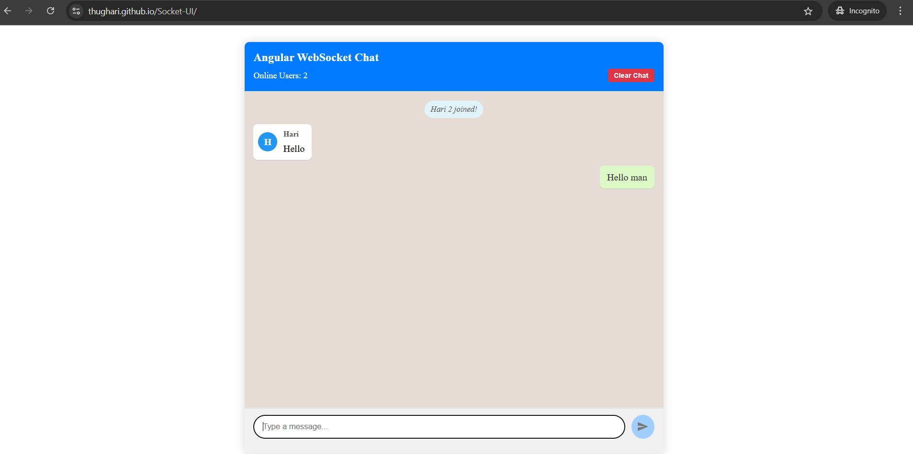
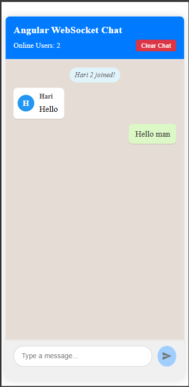

# SocketUI

SocketUI is a real-time chat application built with Angular. It demonstrates the use of WebSockets for instant messaging, providing a responsive and interactive user experience.

> **Note:** SocketUI does **not** store any messages on the server. All chat messages are saved only in your browser's local storage and will be deleted if you clear the chat.

## Features

- Real-time messaging using WebSockets
- Modern Angular UI
- Responsive design
- Messages stored only in local storage (not on the server)
- Easy to set up and run locally

## Screenshots

Here are some sample screenshots of SocketUI:

| Chat Window | Responsive Design |
|-------------|------------------|
|  |  |

## Live Demo

Check out the live demo: [https://thughari.github.io/Socket-UI/](https://thughari.github.io/Socket-UI/)

## Related Repositories

- **Frontend (this repo):** [https://github.com/thughari/Socket-UI](https://github.com/thughari/Socket-UI)
- **Backend:** [https://github.com/thughari/chat](https://github.com/thughari/chat)

## Getting Started

### Prerequisites

- [Node.js](https://nodejs.org/)
- [Angular CLI](https://angular.dev/tools/cli)

### Installation

1. Clone the repository:
    ```bash
    git clone https://github.com/thughari/Socket-UI.git
    cd Socket-UI
    ```
2. Install dependencies:
    ```bash
    npm install
    ```

### Development Server

Run the development server:
```bash
ng serve
```
Navigate to `http://localhost:4200/`. The app will automatically reload if you change any source files.

### Building the Project

To build the project for production:
```bash
ng build
```
The build artifacts will be stored in the `dist/` directory.

## Contributing

Contributions are welcome! Please open issues or submit pull requests for improvements.

## License

This project is licensed under the MIT License.
